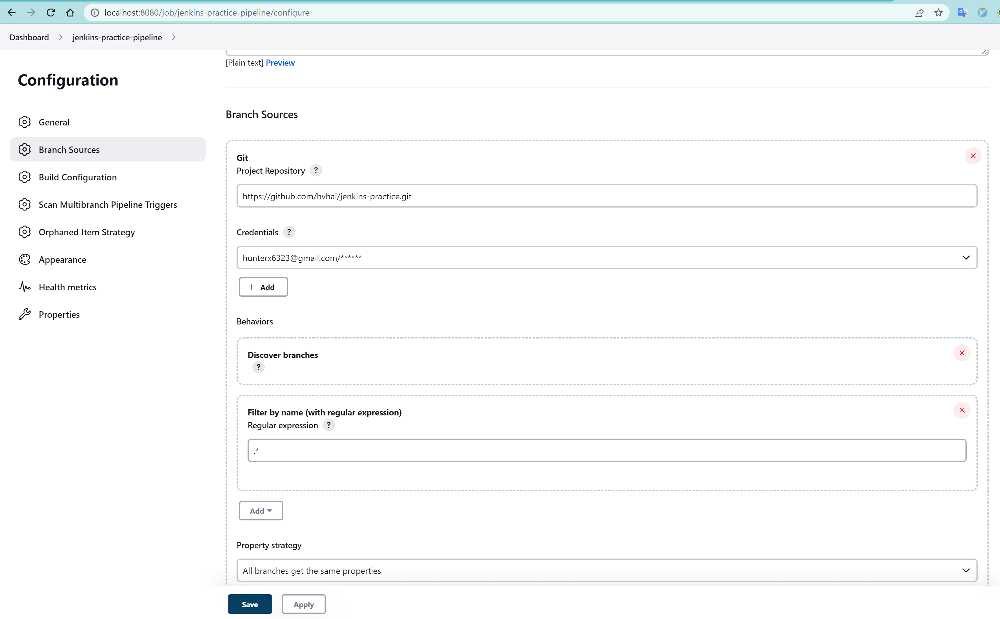
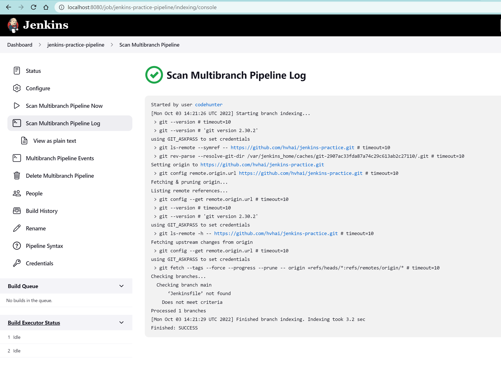
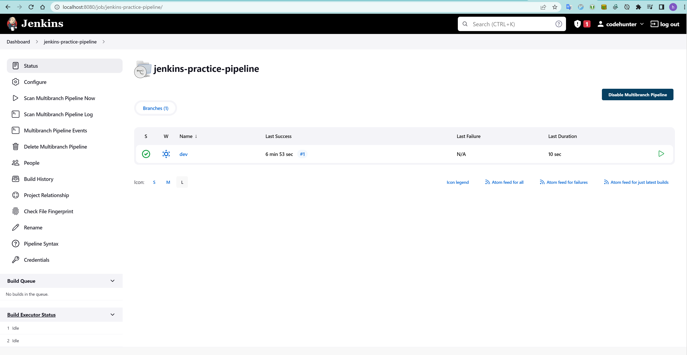
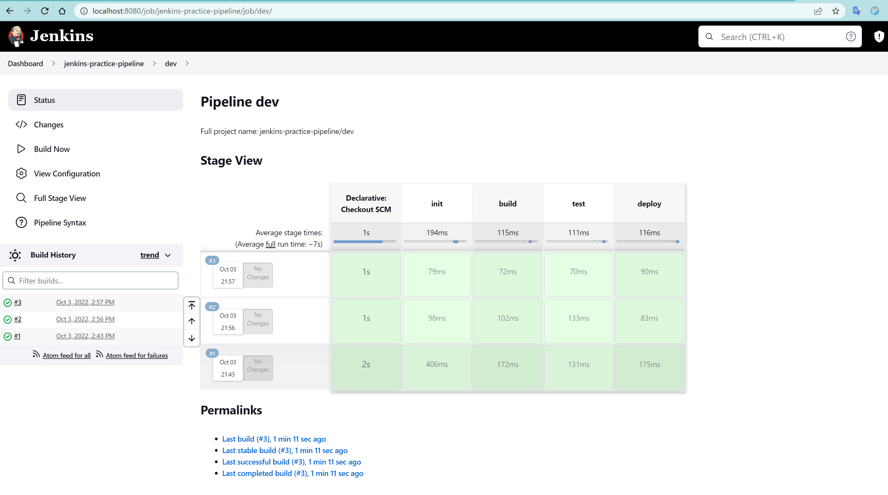
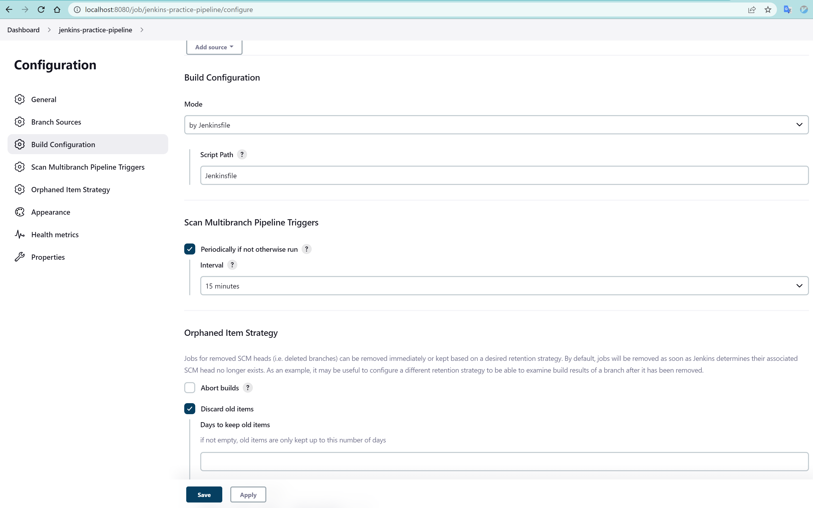

# Jenkins tutorial

## Run jenkin from docker

```shell
docker run -p 8080:8080 -p 50000:50000 -d -v jenkins_home:/var/jenkins_home jenkins/jenkins:lts
```

## Create multiple branches pipeline

1. Create credential

    Credential scope:
    - global: Everywhere
    - system: Only for Jenkins server not for Jenkins job
    - project: Only for the project pipeline

2. Add credential to the project config
   
3. Run scan source in pipline
   

## Create first Jenkinsfile

1. Create simple [Jenkinsfile](/Jenkinsfile) in *dev* branch and push to the git repo
   ```groovy
   pipeline {
      agent any
      stages {
         stage("init") {
            steps {
               echo 'hello Jenkins'
            }
         }

         stage("build") {
            steps {
               echo 'build project'
            }
         }

         stage("test") {
            steps {
               echo 'test project'
            }
         }

         stage("deploy") {
            steps {
               echo 'deploy project'
            }
         }
      }
   }
   ```

2. Run the scan pipeline, the dev run will show success:
   
3. Click on dev to see the buid details
   

## Trigger build automatically

1. Pushing build using web hook
   Need support from source code repository
2. Polling with interval
   
   
